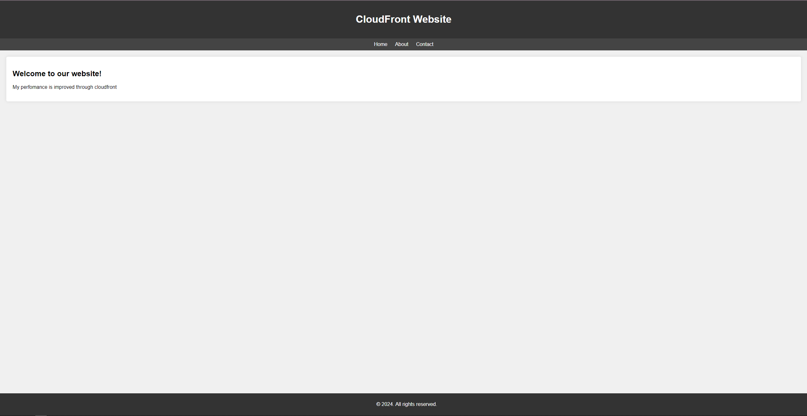
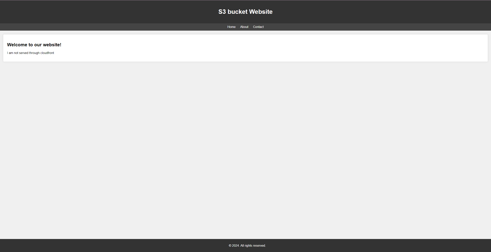

# Enhancing Website Performance with CDN
.png>)

### Cloudfront Website


### SE website



+ Checking s3 uncached website response time ```curl -w "TTFB: %{time_starttransfer}| Total time: %{time_total} \n" -o /dev/null -vsL http://uncachecontentbuckets3.s3-website-us-east-1.amazonaws.com/```
+ Checking cloudfront respsne ```curl -w "TTFB: %{time_starttransfer}| Total time: %{time_total} \n" -o /dev/null -vsL https://d1zvjexmyq20af.cloudfront.net/```


